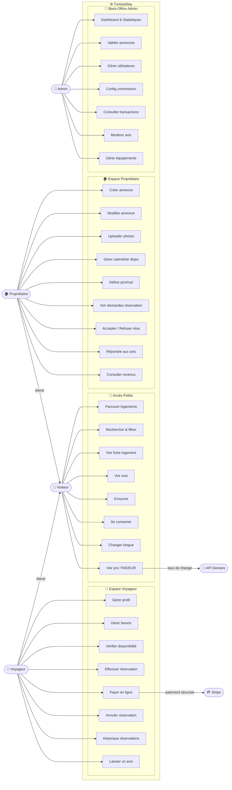

# 📐 TunisiaStay — Use Case & Diagramme de Classes

> **Projet :** TunisiaStay — Plateforme de réservation de vacances en Tunisie  
> **Stack :** Symfony 7 · PHP 8.3 · PostgreSQL  
> **Version :** 1.0 — Étape 1 (Fondations)

---

## 1. 🎭 Diagramme des Cas d'Utilisation (Use Case)

### 1.1 Acteurs du Système

| Acteur | Description |
|---|---|
| **Visiteur** | Utilisateur non authentifié, peut parcourir et rechercher |
| **Voyageur** | Utilisateur inscrit qui cherche et réserve des logements |
| **Propriétaire** | Utilisateur inscrit qui publie et gère ses logements |
| **Admin** | Super-utilisateur qui gère et supervise toute la plateforme |
| **Système de paiement** | Acteur externe (Stripe) qui traite les transactions |
| **Service de devises** | Acteur externe (API) qui fournit les taux de change |

---

### 1.2 Use Cases par Acteur

#### 🔵 VISITEUR

```
UC-V01 : Parcourir les logements disponibles
UC-V02 : Rechercher avec filtres (dates, ville, prix, type)
UC-V03 : Consulter une fiche logement (galerie, équipements, carte)
UC-V04 : Voir les avis et notations
UC-V05 : S'inscrire (Voyageur ou Propriétaire)
UC-V06 : Se connecter
UC-V07 : Changer la langue (FR / EN / AR)
UC-V08 : Voir les prix en TND ou EUR
```

#### 🟢 VOYAGEUR (étend Visiteur)

```
UC-T01 : Gérer son profil (avatar, infos personnelles)
UC-T02 : Ajouter / retirer un logement des favoris
UC-T03 : Vérifier la disponibilité d'un logement (calendrier)
UC-T04 : Effectuer une réservation (checkIn, checkOut, nbGuests)
UC-T05 : Payer en ligne (Stripe — TND ou EUR)
UC-T06 : Annuler une réservation
UC-T07 : Consulter l'historique de ses réservations
UC-T08 : Laisser un avis après séjour (note globale + scores détaillés)
UC-T09 : Recevoir des notifications email (confirmation, rappel, annulation)
```

#### 🟠 PROPRIÉTAIRE (étend Visiteur)

```
UC-O01 : Créer une annonce de logement
UC-O02 : Modifier / supprimer une annonce
UC-O03 : Uploader des photos (galerie ordonnée)
UC-O04 : Gérer le calendrier de disponibilité (bloquer / débloquer des dates)
UC-O05 : Définir un prix par nuit (et prix dynamique par période)
UC-O06 : Consulter les demandes de réservation (en attente)
UC-O07 : Accepter ou refuser une réservation
UC-O08 : Répondre aux avis des voyageurs
UC-O09 : Consulter ses revenus (net après commission)
UC-O10 : Recevoir des notifications email (nouvelle réservation, paiement)
```

#### 🔴 ADMIN

```
UC-A01 : Tableau de bord global (statistiques revenus, réservations, utilisateurs)
UC-A02 : Valider / rejeter les annonces soumises par les propriétaires
UC-A03 : Suspendre ou bannir un compte utilisateur
UC-A04 : Configurer le taux de commission (global ou par tranche)
UC-A05 : Consulter toutes les transactions et commissions perçues
UC-A06 : Modérer les avis (cacher / afficher)
UC-A07 : Gérer les équipements de référence (Amenity)
UC-A08 : Exporter des rapports (CSV / PDF)
UC-A09 : Envoyer des notifications système aux utilisateurs
```

---

### 1.3 Diagramme Use Case — Vue Mermaid



---

### 1.4 Relations entre Use Cases (Include & Extend)

| Use Case | Relation | Use Case lié | Type |
|---|---|---|---|
| `UC-T04 Effectuer réservation` | `<<include>>` | `UC-T03 Vérifier disponibilité` | Obligatoire |
| `UC-T04 Effectuer réservation` | `<<include>>` | `UC-T05 Payer en ligne` | Obligatoire |
| `UC-T05 Payer en ligne` | `<<include>>` | `Calculer commission` | Obligatoire |
| `UC-T05 Payer en ligne` | `<<include>>` | `Bloquer les dates` | Obligatoire |
| `UC-T08 Laisser un avis` | `<<extend>>` | `O8 Répondre à l'avis` | Optionnel (propriétaire) |
| `UC-O01 Créer annonce` | `<<include>>` | `UC-A02 Valider annonce` | Workflow Admin |
| `UC-T06 Annuler réservation` | `<<extend>>` | `Remboursement Stripe` | Optionnel (si confirmé) |

---

## 2. 🏗️ Diagramme de Classes

### 2.1 Vue complète — Mermaid

```mermaid
classDiagram

    %% =====================
    %% ENTITÉS PRINCIPALES
    %% =====================

    class User {
        +int id
        +string email
        +string password
        +string firstName
        +string lastName
        +string phone
        +string avatarUrl
        +string locale
        +array roles
        +bool isVerified
        +string stripeAccountId
        +DateTime createdAt
        +DateTime updatedAt
        +register() void
        +login() string
        +updateProfile() void
        +isOwner() bool
        +isTraveler() bool
        +isAdmin() bool
    }

    class Property {
        +int id
        +string title
        +string slug
        +string description
        +string type
        +float pricePerNight
        +string currency
        +int maxGuests
        +int rooms
        +int bathrooms
        +float latitude
        +float longitude
        +string address
        +string city
        +string region
        +string status
        +DateTime createdAt
        +DateTime updatedAt
        +publish() void
        +suspend() void
        +getAverageRating() float
        +isAvailable(Date checkIn, Date checkOut) bool
    }

    class Booking {
        +int id
        +Date checkIn
        +Date checkOut
        +int nbGuests
        +int nbNights
        +float baseAmount
        +float commissionRate
        +float commissionAmount
        +float totalAmount
        +string currency
        +float amountInEur
        +string status
        +DateTime createdAt
        +DateTime confirmedAt
        +DateTime cancelledAt
        +confirm() void
        +cancel() void
        +complete() void
        +calculateNights() int
        +calculateTotal() float
    }

    class Payment {
        +int id
        +float amount
        +string currency
        +string stripePaymentIntentId
        +string status
        +DateTime paidAt
        +process() bool
        +refund() bool
        +markSucceeded() void
        +markFailed() void
    }

    class Review {
        +int id
        +int rating
        +string comment
        +int cleanlinessScore
        +int locationScore
        +int valueScore
        +string ownerReply
        +bool isVisible
        +DateTime createdAt
        +moderate(bool visible) void
        +addOwnerReply(string reply) void
        +getGlobalScore() float
    }

    class Amenity {
        +int id
        +string name
        +string icon
        +string category
    }

    class Media {
        +int id
        +string filename
        +string mimeType
        +int size
        +int position
        +string type
        +getUrl() string
        +reorder(int position) void
    }

    class Availability {
        +int id
        +Date date
        +bool isAvailable
        +float customPrice
        +block() void
        +unblock() void
        +hasCustomPrice() bool
    }

    class CommissionConfig {
        +int id
        +float rate
        +float minAmount
        +float maxAmount
        +bool isActive
        +DateTime createdAt
        +activate() void
        +deactivate() void
    }

    %% =====================
    %% SERVICES (SYMFONY)
    %% =====================

    class CommissionCalculator {
        <<Service>>
        -CommissionConfigRepository configRepo
        +calculate(Money baseAmount) CommissionResult
    }

    class CurrencyConverter {
        <<Service>>
        -HttpClientInterface client
        -CacheInterface cache
        -string apiKey
        +convert(float amount, string from, string to) float
        -fetchRate(string from, string to) float
    }

    class BookingService {
        <<Service>>
        -AvailabilityChecker availabilityChecker
        -CommissionCalculator commissionCalc
        -EventDispatcherInterface dispatcher
        +createBooking(BookingRequest dto) Booking
        +confirmBooking(Booking booking) void
        +cancelBooking(Booking booking) void
    }

    class AvailabilityChecker {
        <<Service>>
        -AvailabilityRepository availabilityRepo
        +isAvailable(Property p, Date checkIn, Date checkOut) bool
        +blockDates(Property p, Date checkIn, Date checkOut) void
        +getAvailableDates(Property p, Date from, Date to) array
    }

    class StripeService {
        <<Service>>
        -string stripeSecretKey
        +createPaymentIntent(float amount, string currency) string
        +capturePayment(string paymentIntentId) bool
        +refundPayment(string paymentIntentId) bool
        +createConnectedAccount(User owner) string
        +transferFunds(float amount, string accountId) bool
    }

    %% =====================
    %% DTO
    %% =====================

    class BookingRequest {
        <<DTO>>
        +int propertyId
        +int travelerId
        +Date checkIn
        +Date checkOut
        +int nbGuests
        +string currency
    }

    class CommissionResult {
        <<DTO>>
        +Money base
        +Money commission
        +Money total
        +float rate
    }

    class SearchFilters {
        <<DTO>>
        +string city
        +Date checkIn
        +Date checkOut
        +int guests
        +float minPrice
        +float maxPrice
        +array amenityIds
        +string type
        +string sortBy
    }

    %% =====================
    %% EVENTS
    %% =====================

    class BookingConfirmedEvent {
        <<Event>>
        +Booking booking
    }

    class PropertyPublishedEvent {
        <<Event>>
        +Property property
    }

    %% =====================
    %% RELATIONS
    %% =====================

    %% User relations
    User "1" --> "0..*" Property : owns
    User "1" --> "0..*" Booking : makes (traveler)
    User "1" --> "0..*" Review : writes

    %% Property relations
    Property "1" --> "0..*" Booking : has
    Property "1" --> "0..*" Media : has
    Property "1" --> "0..*" Availability : has
    Property "1" --> "0..*" Review : receives
    Property "0..*" --> "0..*" Amenity : has

    %% Booking relations
    Booking "1" --> "1" Payment : has
    Booking "1" --> "1" User : traveler
    Booking "1" --> "1" Property : for

    %% Services relations
    BookingService ..> CommissionCalculator : uses
    BookingService ..> AvailabilityChecker : uses
    BookingService ..> StripeService : uses
    BookingService ..> BookingRequest : receives
    BookingService ..> BookingConfirmedEvent : dispatches

    CommissionCalculator ..> CommissionResult : produces
    CommissionCalculator ..> CommissionConfig : reads

    %% Events
    BookingConfirmedEvent --> Booking : wraps
    PropertyPublishedEvent --> Property : wraps
```



---

### 2.2 Description des Relations

#### Relations d'Association

| Entité A | Cardinalité | Entité B | Description |
|---|---|---|---|
| `User` | `1 → 0..*` | `Property` | Un propriétaire possède zéro à plusieurs logements |
| `User` | `1 → 0..*` | `Booking` | Un voyageur effectue zéro à plusieurs réservations |
| `User` | `1 → 0..*` | `Review` | Un voyageur écrit zéro à plusieurs avis |
| `Property` | `1 → 0..*` | `Booking` | Un logement a zéro à plusieurs réservations |
| `Property` | `1 → 0..*` | `Media` | Un logement a une à plusieurs photos |
| `Property` | `1 → 0..*` | `Availability` | Un logement a une ligne par jour calendaire |
| `Property` | `1 → 0..*` | `Review` | Un logement reçoit zéro à plusieurs avis |
| `Property` | `0..* ↔ 0..*` | `Amenity` | Relation ManyToMany via table pivot |
| `Booking` | `1 → 1` | `Payment` | Une réservation a exactement un paiement |

#### Relations de Dépendance (Services)

| Service | Dépend de | Rôle |
|---|---|---|
| `BookingService` | `CommissionCalculator` | Calcule la commission lors de la création |
| `BookingService` | `AvailabilityChecker` | Vérifie et bloque les dates |
| `BookingService` | `StripeService` | Déclenche le paiement |
| `CommissionCalculator` | `CommissionConfig` | Lit le taux actif en base |
| `CurrencyConverter` | API externe (cache) | Convertit TND ↔ EUR |

---

## 3. 📋 Récapitulatif des Entités Doctrine

```
src/Entity/
├── User.php               → Discriminator roles (Owner, Traveler, Admin)
├── Property.php           → Annonce logement
├── Booking.php            → Réservation (snapshot commission)
├── Payment.php            → Transaction Stripe (OneToOne Booking)
├── Review.php             → Avis voyageur + réponse propriétaire
├── Amenity.php            → Table référence équipements
├── Media.php              → Photos/vidéos ordonnées
├── Availability.php       → Calendrier dispo (1 ligne = 1 jour)
└── CommissionConfig.php   → Taux de commission Admin

src/Service/
├── Pricing/
│   ├── CommissionCalculator.php
│   └── PriceBuilder.php
├── Currency/
│   └── CurrencyConverter.php
├── Booking/
│   ├── BookingService.php
│   └── AvailabilityChecker.php
├── Payment/
│   └── StripeService.php
└── Notification/
    └── EmailService.php

src/DTO/
├── BookingRequest.php
├── CommissionResult.php
└── SearchFilters.php

src/Event/
├── BookingConfirmedEvent.php
└── PropertyPublishedEvent.php
```

---

## 4. ✅ Prochaine Étape

> **Étape 2 :** Installation Symfony 7, configuration PostgreSQL, génération des entités Doctrine avec toutes les relations, et migrations de base de données.

---

*Document généré pour le projet TunisiaStay — Architecture v1.0*
